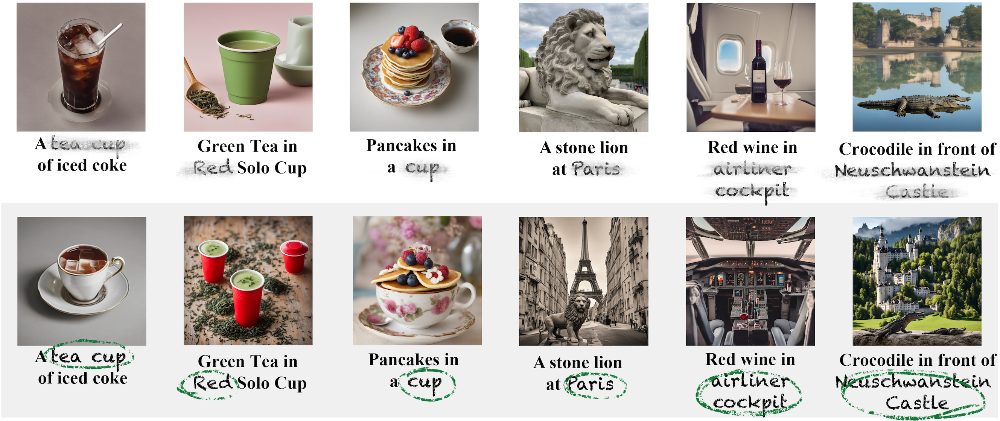

# A tea cup of iced coke

This is the official codebase for [Lost in Translation: Latent Concept Misalignment in Text-to-Image Diffusion Models](https://ai4bio.pages.dev/publication/LCMis). The LC-Mis concept pairs for Level 5 discovered through LLMs can be found in our [database](https://huggingface.co/datasets/Tutu1/LatentConceptMisalignment/tree/main/version1).

This repository is based on [Diffusers](https://github.com/huggingface/diffusers), using the model check points they released.

## Quick Demo
You can manually adjust the proportion of steps allocated to different concepts during the diffusion models sampling process:
```
pip install --upgrade diffusers[torch]
```
Then adjust "*step_ratio*" to quickly get started:
```python
import torch
from diffusers import DiffusionPipeline

step_ratio = 0.2
first_concept = "a tea cup"
prompt = "a tea cup of iced coke"

base = DiffusionPipeline.from_pretrained(
    "stabilityai/stable-diffusion-xl-base-1.0",
    torch_dtype=torch.float16,
    variant="fp16",
    use_safetensors=True
).to("cuda")

refiner = DiffusionPipeline.from_pretrained(
    "stabilityai/stable-diffusion-xl-refiner-1.0",
    text_encoder_2=base.text_encoder_2,
    vae=base.vae,
    torch_dtype=torch.float16,
    use_safetensors=True,
    variant="fp16",
).to("cuda")

image = base(
    prompt=first_concept,
    num_inference_steps=40,
    denoising_end=step_ratio,
    output_type="latent",
).images
image = refiner(
    prompt=prompt,
    num_inference_steps=40,
    denoising_start=step_ratio,
    image=image,
).images[0]

image.save("img.png")
```

## Requirements
```
conda create -n iced_coke python=3.8
```
Then install torch from its [official website](https://pytorch.org), such as:
```
pip install torch==2.0.1 torchvision==0.15.2 torchaudio==2.0.2 --index-url https://download.pytorch.org/whl/cu118
```
Then install other packages:
```
cd iced_coke
pip install -e ./diffusers
pip install git+https://github.com/openai/CLIP.git
pip install transformers accelerate pycocoevalcap scikit-learn image-reward
pip install pillow==9.5.0
```

## Sampling
```
bash run.sh
```